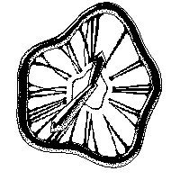

# Dali Clock

This is a watch face for the open E-Ink display smartwatch [Watchy](https://watchy.sqfmi.com/).

## Features

- Display time.
- Display battery state as rim thickness around clock.

## Upload instructions

### I did not use Arduino IDE

I implemented Daly Clock using the [platformIO](https://platformio.org/) extension for VS Code, as I can't bear coding in the Arduino IDE anymore. I'm reasonably certain you can just clone this repo and open the project in any platformIO enabled IDE. All necessary dependencies should be installed automatically.  
I even added a `min_spiffs.csv` file and referenced it in the `platformio.ini`, which I think assures the compiler there's enough space on the ESP32 for all those bitmaps and stuff.  
What I want to say is: it's entirely possible platformIO will just compile and upload the code to your Watchy (but see right below first!).

## Compiliation for different Watchy versions

Change `build_flags` in `platformio.ini` to match your Watchy version.

## Thanks and contributions

### mehtmehtsen - creator of BotWatchy face

I based this project on his [BotWatchy](https://github.com/mehtmehtsen/BotWatchy).

